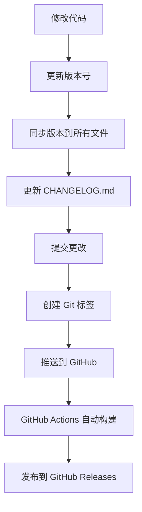

# 发布指南

本文档详细说明了 KKAPE Gearbox 的版本管理和自动化发布流程。

## 🎯 发布流程概览



## 📋 版本管理

### 版本号规则

项目遵循 [语义化版本](https://semver.org/lang/zh-CN/) 规范：

- **主版本号 (Major)**: 不兼容的 API 修改
- **次版本号 (Minor)**: 向下兼容的功能性新增  
- **修订号 (Patch)**: 向下兼容的问题修正

### 版本升级命令

```bash
# 修订版本 (0.1.0 -> 0.1.1)
pnpm bump:patch

# 次版本 (0.1.0 -> 0.2.0)  
pnpm bump:minor

# 主版本 (0.1.0 -> 1.0.0)
pnpm bump:major

# 预发布版本 (0.1.0 -> 0.1.0-beta.1)
pnpm bump:prerelease
```

### 版本同步

版本号会自动同步到以下文件：
- `package.json` (根目录)
- `apps/shell/tauri.conf.json`
- `apps/shell/Cargo.toml`
- `ui/shell/package.json`

## 🚀 发布流程

### 方式一：自动发布 (推荐)

```bash
# 1. 升级版本号
pnpm bump:patch  # 或 minor/major

# 2. 编辑 CHANGELOG.md 添加变更内容
# 3. 一键发布
pnpm release
```

### 方式二：手动发布

```bash
# 1. 手动更新版本号
# 编辑 package.json 中的 version 字段

# 2. 同步版本到其他文件
pnpm sync:version

# 3. 更新变更日志
# 编辑 CHANGELOG.md

# 4. 提交更改
git add .
git commit -m "chore: release v1.0.0"

# 5. 创建标签
git tag v1.0.0

# 6. 推送到远程
git push origin main --tags
```

## 🤖 自动化构建

### GitHub Actions 工作流

当推送带有 `v*` 标签时，GitHub Actions 会自动：

1. **创建 Release**: 基于标签创建 GitHub Release
2. **多平台构建**: 并行构建所有支持的平台
3. **上传资产**: 将构建产物上传到 Release
4. **更新描述**: 自动生成下载链接和安装说明

### 支持的平台

| 平台 | 架构 | 产物格式 | 文件名 |
|------|------|----------|--------|
| Windows | x64 | MSI 安装包 | `kkape-gearbox-{version}-windows-x64.msi` |
| macOS | x64 | DMG 镜像 | `kkape-gearbox-{version}-macos-x64.dmg` |
| macOS | ARM64 | DMG 镜像 | `kkape-gearbox-{version}-macos-aarch64.dmg` |
| Linux | x64 | AppImage | `kkape-gearbox-{version}-linux-x86_64.AppImage` |

### 构建时间

- **Windows**: ~15-20 分钟
- **macOS**: ~20-25 分钟  
- **Linux**: ~10-15 分钟

## 📦 发布检查清单

发布前请确保：

- [ ] 代码已通过所有测试
- [ ] 版本号已正确升级
- [ ] CHANGELOG.md 已更新
- [ ] 图标文件已生成 (`pnpm check:icons`)
- [ ] 本地构建测试通过 (`pnpm build`)
- [ ] Git 工作目录干净
- [ ] 已推送到主分支

## 🔧 故障排除

### 构建失败

1. **检查依赖**: 确保所有依赖已正确安装
2. **检查图标**: 运行 `pnpm check:icons` 验证图标
3. **本地测试**: 先在本地运行 `pnpm build` 测试
4. **查看日志**: 检查 GitHub Actions 的详细日志

### 版本冲突

1. **检查标签**: 确保标签名称唯一
2. **删除标签**: 如需重新发布，先删除现有标签
   ```bash
   git tag -d v1.0.0
   git push origin :refs/tags/v1.0.0
   ```

### 上传失败

1. **检查权限**: 确保 GitHub Token 有足够权限
2. **文件大小**: 检查构建产物大小是否超限
3. **网络问题**: 重新触发工作流

## 📊 发布统计

### 发布频率建议

- **Patch 版本**: 每周或按需发布
- **Minor 版本**: 每月发布
- **Major 版本**: 每季度或半年发布

### 版本生命周期

- **开发版本**: 主分支持续集成
- **预发布版本**: beta/alpha 测试
- **稳定版本**: 正式发布
- **维护版本**: 安全更新和关键修复

## 🔄 自动更新

### Tauri Updater 配置

应用内置自动更新功能：

```json
{
  "plugins": {
    "updater": {
      "active": true,
      "endpoints": [
        "https://releases.kkape.com/gearbox/{{target}}/{{arch}}/{{current_version}}"
      ],
      "dialog": true
    }
  }
}
```

### 更新服务器

需要配置更新服务器提供：
- 版本检查 API
- 增量更新包
- 签名验证

## 📚 相关资源

- [语义化版本规范](https://semver.org/lang/zh-CN/)
- [Keep a Changelog](https://keepachangelog.com/zh-CN/1.0.0/)
- [Tauri 发布指南](https://tauri.app/v1/guides/distribution/publishing)
- [GitHub Actions 文档](https://docs.github.com/en/actions)

## 🎯 最佳实践

1. **频繁发布**: 小步快跑，频繁发布小版本
2. **详细日志**: 维护详细的变更日志
3. **测试覆盖**: 确保充分的测试覆盖
4. **向后兼容**: 尽量保持 API 向后兼容
5. **安全优先**: 及时修复安全问题
6. **用户反馈**: 收集和响应用户反馈

## 🚨 紧急发布

如需紧急发布修复关键问题：

```bash
# 1. 创建热修复分支
git checkout -b hotfix/critical-fix

# 2. 修复问题并测试
# 3. 升级补丁版本
pnpm bump:patch

# 4. 快速发布
pnpm release

# 5. 合并回主分支
git checkout main
git merge hotfix/critical-fix
```
